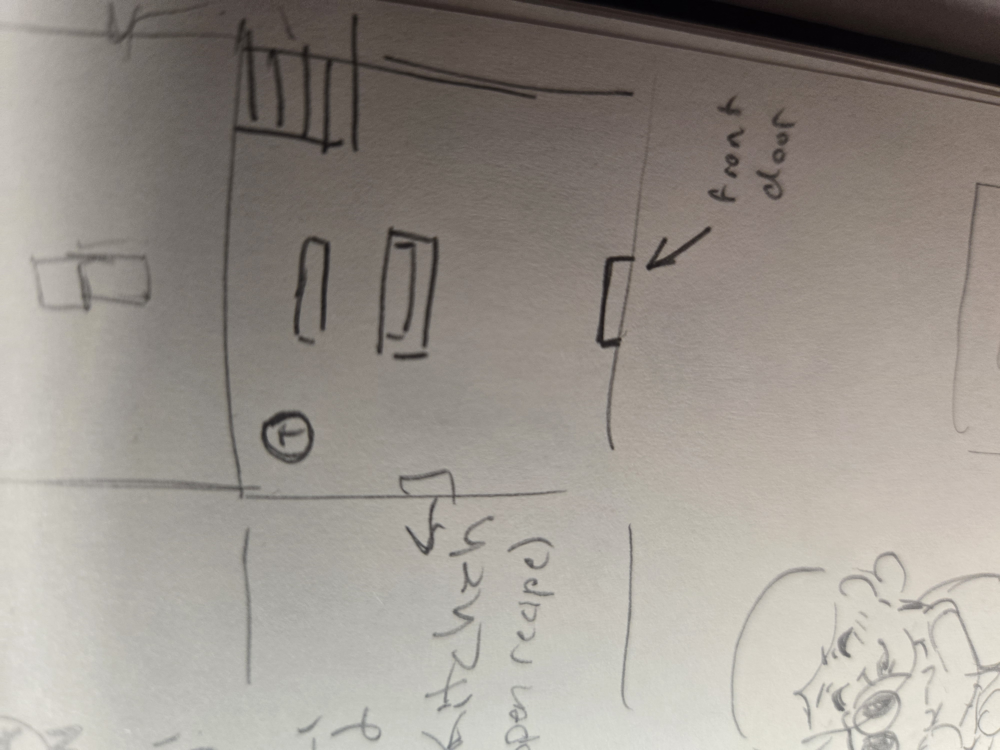
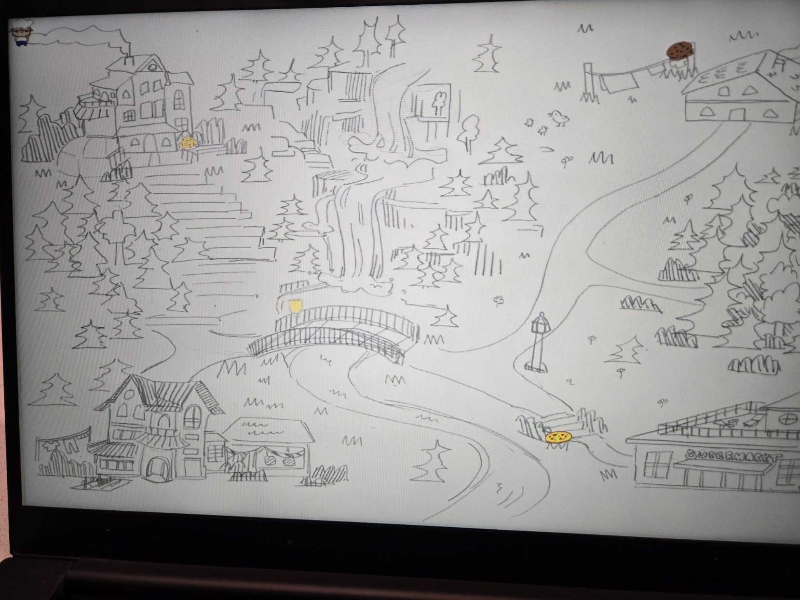

:warning: Everything between << >> needs to be replaced (remove << >> after replacing)

# A Week with Kana
## CS110 Final Project  Fall, 2024

## Team Members

Rijaa Zaidi & Bianna Chen

***

## Project Description

A game where the player is given one in game week to collect recipies to feed their pet cat.

***    

## GUI Design

### Initial Design

### Final Design

## Program Design

### Features

1. Moving Character
2. NPCS with text
3. Moving between different areas
4. Being able to exit the game
5. Being able to press keys to interact

### Classes

- << You should have a list of each of your classes with a description >>

## ATP

| Step                 |Procedure             |Expected Results                   |
|----------------------|:--------------------:|----------------------------------:|
|  1                   | Run Counter Program  |GUI window appears with count = 0  |
|  2                   | click count button   | display changes to count = 1      |
etc...
